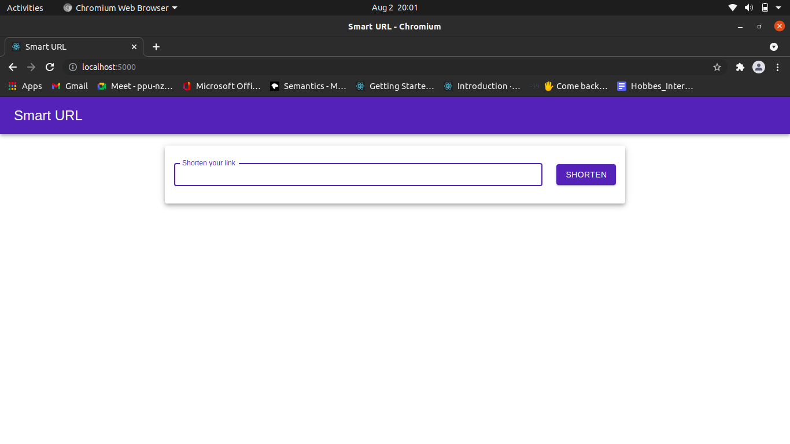
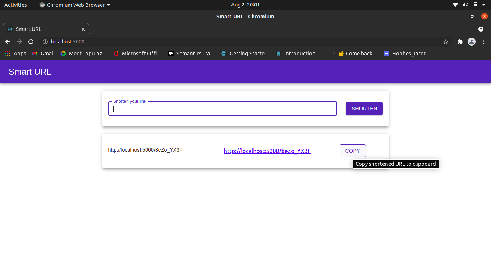
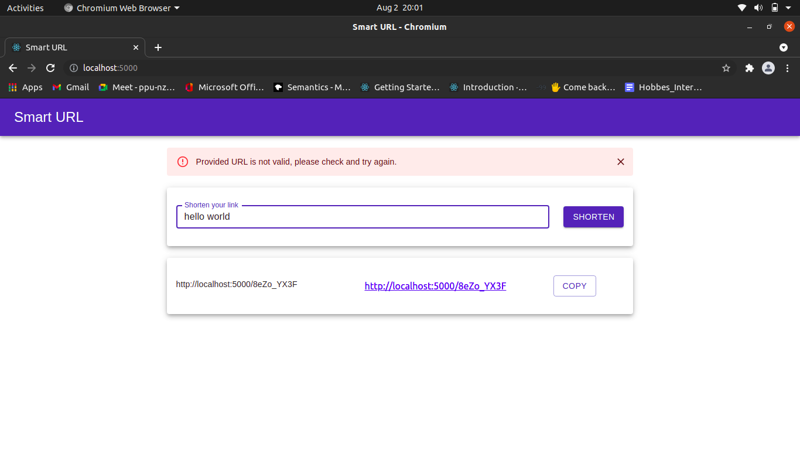
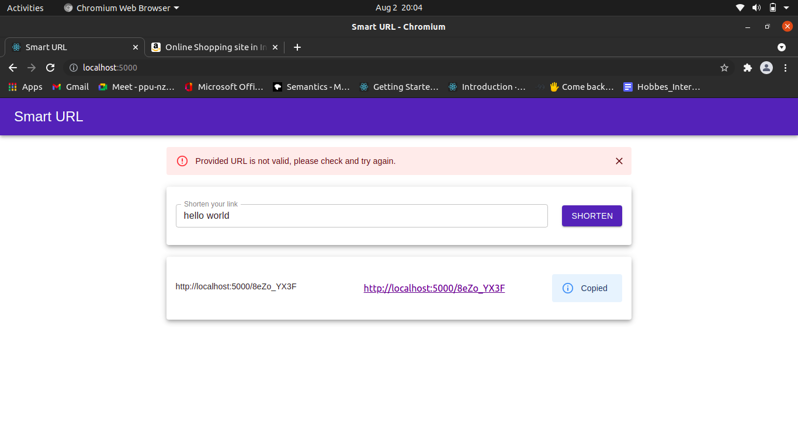

## URL shortner
- Accepts your working URL and provide shortened and abstract URL(doesn't contain info about your URL) and someone can visit your URL view by using this shortened URl.

### Running into your system
#### How to run
- Prerequestie
  - `node`
  - `npm`
- Clone repository to your system and follow below listed commands
```sh
cd <repository directory>
cd ui
npm install
npm run nuild
cd ..
npm i
npm start
```

#### Running application in a `docker` container
- Prerequesties
  - `docker`
  - `docker-compose`
- Follow below listed commands
```sh
docker-compose up --build -d
```

#### Use the application
- Open `http://localhost:3000`

- Give your URL and submit

- Get shortened URL

- Copy shortened URL by Clicking to `Copy` button

- You will be able to open your given page itself using this shortened URL
